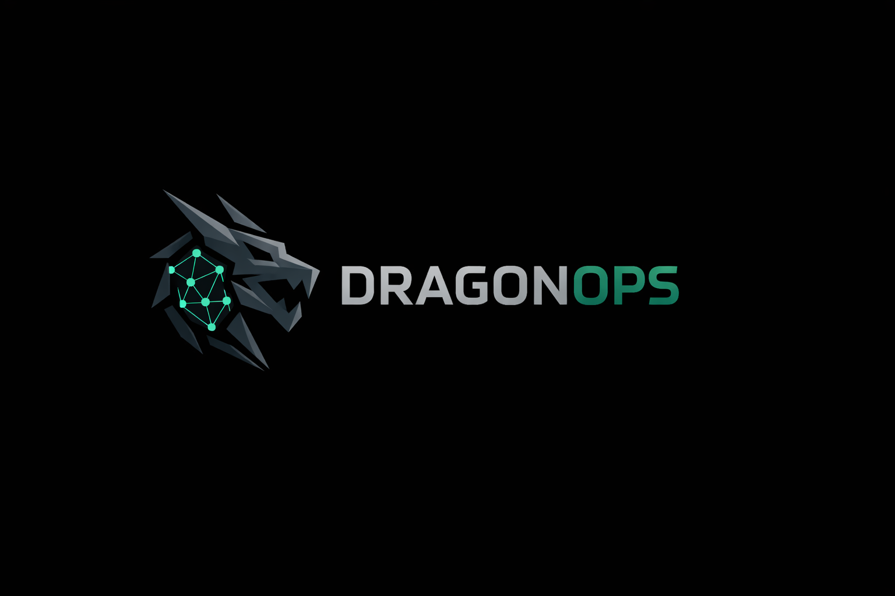

# DragonOps
DragonOps is a high-performance UDP client–server framework with a modern, modular server UI and a lightweight, resilient client. Designed for networking research, automation, and advanced remote management in authorized environments.

---

  

## Features

### Server – Dragon
The Dragon server is built to provide full control and monitoring over connected clients. Its intuitive interface allows users to:
- **Monitor client status in real-time**  
- **Execute a wide range of commands** across multiple clients simultaneously  
- **Automate routine tasks** and workflows  
- **Visualize network activity and client connectivity**  
- **Handle high-volume operations efficiently**  

  

Dragon is designed to be **modular and extensible**, allowing researchers and developers to add new features without restructuring the entire codebase. Its built-in dashboards provide a clean overview of connected clients and system activity.

### Client – Warrior
The Warrior client is lightweight and efficient. It is designed for **reliable connection management** and seamless integration with the server:
- **Automatic reconnection** if the client loses contact with the server  
- **Lightweight footprint**, optimized for minimal system impact  
- **Secure and reliable communication** over UDP  
- **Easy deployment** with self-contained configuration and dependencies  

The client emphasizes **stability, security, and controlled interaction**, making it ideal for testing networks, automation scripts, or managing authorized endpoints in educational and research environments.

---

## Use Cases

DragonOps is ideal for:
- Networking research and protocol testing  
- Remote system monitoring in lab environments  
- Automation of tasks across multiple controlled clients  
- Learning about UDP architectures, real-time command execution, and distributed network systems  

It is **strictly intended for legal and educational use** on systems you own or have explicit permission to manage.
